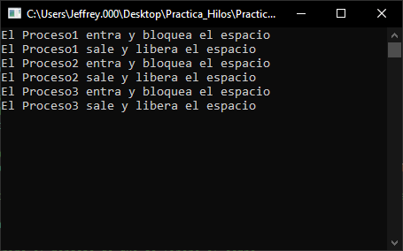

# Ejemplo del uso de hilos y Monitor en C#

El ejemplo muestra la creación de procesos por medio de hilos.
Cuando un hilo entra en monitor, bloquea la entrada. Los demás procesos deben esperar a que el espacio sea desbloqueado para poder entrar.

## Captura

